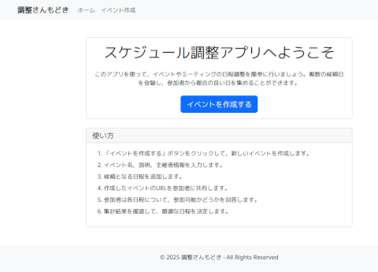
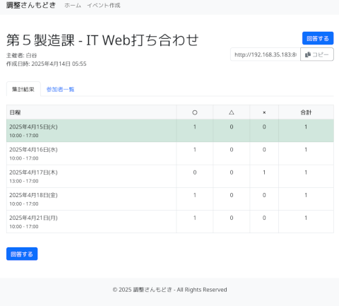

# スケジュール調整アプリ

PHP と PostgreSQL を使用した、イベントやミーティングの日程調整を行うためのWebアプリケーションです。調整さんのアイディアをぱくってオンプレ版にしてます

 




## 主な機能

- イベントの作成機能
- 日程候補の登録
- 参加者の回答登録と修正
- 結果の集計と表示

## インストール方法

### 必要条件

- PHP 7.4以上
- PostgreSQL 10以上
- Composer (オプション)

### セットアップ手順

1. リポジトリをクローンするか、ダウンロードして解凍します。

```
git clone http://192.168.30.40:8080/git/shiratani/Schedule_adjustment_app.git
cd Schedule_adjustment_app
```

2. PostgreSQLデータベースを作成し、テーブルを設定します。

```
createdb schedule_app
psql -d schedule_app -f database_setup.sql
```

3. `config.php` ファイルを編集し、データベース接続情報を設定します。

```php
define('DB_HOST', 'localhost');
define('DB_NAME', 'schedule_app');
define('DB_USER', 'your_username');
define('DB_PASSWORD', 'your_password');
define('BASE_URL', 'http://localhost/schedule_app/');
```

4. Webサーバーのドキュメントルートにファイルを配置するか、開発サーバーを起動します。

```
php -S localhost:8000
```

5. ブラウザで `http://localhost:8000` にアクセスして、アプリケーションを使用開始します。

## 使い方

1. トップページから「イベントを作成する」ボタンをクリックします。
2. イベント名、説明、主催者情報を入力します。
3. 候補となる日程を追加します（複数可）。
4. 作成したイベントのURLを参加者に共有します。
5. 参加者は各日程について、参加可能かどうかを回答します。
6. 集計結果から最適な日程を決定します。

## ファイル構成

- `index.php` - トップページ
- `create.php` - イベント作成フォーム
- `create_event.php` - イベント作成処理
- `event.php` - イベント詳細・集計結果表示
- `respond.php` - 参加者回答フォーム
- `submit_response.php` - 回答処理
- `edit_response.php` - 回答編集ユーティリティ
- `functions.php` - 共通関数
- `config.php` - 設定ファイル
- `layout.php` - レイアウトテンプレート
- `database_setup.sql` - データベースセットアップスクリプト

## ライセンス

MIT
